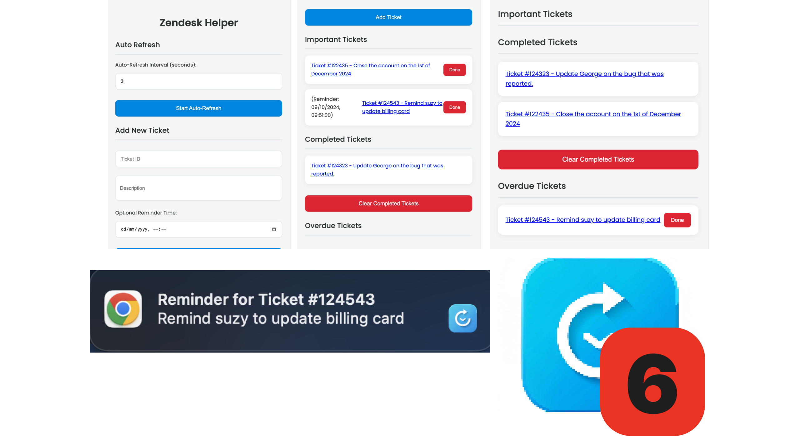

# **Zendesk Refresh & Remind**

**Zendesk Refresh & Remind** is a Chrome extension designed to streamline your Zendesk workflow. This tool allows users to set auto-refresh intervals for tickets, mark important tickets, and receive reminders for high-priority tasks—all in a clean, intuitive interface that integrates seamlessly with Zendesk.

## **Features**

- **Auto-Refresh Tickets:** Customize the refresh interval for your Zendesk tickets, ensuring they stay up-to-date without the need for manual refreshing.
- **Important Tickets & Reminders:** Add important tickets with optional reminders, so you never miss critical tasks or deadlines. Set reminders for key tickets and receive notifications at the appropriate time.
- **Simple UI:** The extension features an easy-to-use interface, letting you manage your tickets with minimal effort.

## **Installation**

1. Go to the [Chrome Web Store](https://chrome.google.com/webstore/category/extensions) and search for **Zendesk Refresh & Remind**.
2. Click on **Add to Chrome** to install the extension.
3. Once installed, you’ll find the **Zendesk Refresh & Remind** icon in your Chrome toolbar.

## **How to Use**

### Auto-Refresh Feature

1. Open the extension by clicking the **Zendesk Refresh & Remind** icon in the Chrome toolbar.
2. Enter the auto-refresh interval (in seconds) in the input field.
3. Click **Start Auto-Refresh** to apply the changes. Zendesk tickets will now refresh automatically according to the set interval.

### Adding Important Tickets with Reminders

1. Open the **Zendesk Refrsh & Remind** popup.
2. Enter the **Ticket ID** and a **Description** in the input fields.
3. Optionally, set a **Reminder Time** to receive notifications for this ticket.
4. Click **Add Ticket** to save it. You will see it appear in the list of important tickets.

### Managing Tickets

- **Mark as Done**: Click the **Done** button next to any important or overdue ticket to mark it as completed.
- **Clear Completed Tickets**: Click **Clear Completed Tickets** to remove all completed tickets from the list.

## **Screenshot**



## **Development Setup**

1. Clone the repository:
   ```bash
   git clone https://github.com/VinhKietLa/zendesk_extension.git
   ```
2. Open Chrome and go to `chrome://extensions/`.
3. Enable **Developer mode** (toggle in the top right).
4. Click **Load unpacked** and select the folder containing the extension files.

## **Technologies Used**

- **JavaScript**: Core functionality of the extension.
- **HTML/CSS**: Popup design and layout.
- **Chrome Extensions API**: Communication with the background and popup scripts.
- **Chrome Storage API**: Used for saving settings and ticket information.

## **Future Enhancements**

- Customizable notification sounds for reminders.
- Support for more detailed ticket information.
- Sync with Zendesk API to provide last ticket update statuses.

## **Contributing**

Contributions are welcome! If you have any suggestions for new features or improvements, feel free to open an issue or submit a pull request or drop me an email.

## **Contact**

For any questions, feel free to reach out to the developer at:

- Email: kietla@live.co.uk
- GitHub: (https://github.com/VinhKietLa/zendesk_extension)
